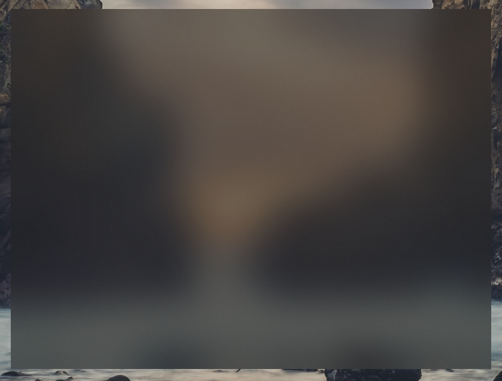

# window-vibrancy

[](https://crates.io/crates/window-vibrancy) [](https://docs.rs/window-vibrancy/) 
[](https://discord.gg/SpmNs4S)

Make your windows vibrant.

> [!Tip]
> If you're using `tauri@v1`, you need to use version `0.4` of this crate.

## Platform-specific

- **Linux**: Unsupported, Blur and any vibrancy effects are controlled by the compositor installed on the end-user system.

## Example

```rs
use window_vibrancy::{apply_blur, apply_vibrancy, NSVisualEffectMaterial};

#[cfg(target_os = "macos")]
apply_vibrancy(&window, NSVisualEffectMaterial::HudWindow, None, None).expect("Unsupported platform! 'apply_vibrancy' is only supported on macOS");

#[cfg(target_os = "windows")]
apply_blur(&window, Some((18, 18, 18, 125))).expect("Unsupported platform! 'apply_blur' is only supported on Windows");
```

## Tauri

if you are using tauri, don't forget to:

* set `html, body { background: transparent }` see [index.html#L12](https://github.com/tauri-apps/window-vibrancy/blob/dev/examples/tauri/public/index.html#L12)
* set `"windows": [ { "transparent": true } ]` see [tauri.conf.json#L57](https://github.com/tauri-apps/window-vibrancy/blob/dev/examples/tauri/src-tauri/tauri.conf.json#L57)
* on **macos** set `"macOSPrivateApi": true` see [tauri.conf.json#L49](https://github.com/tauri-apps/window-vibrancy/blob/dev/examples/tauri/src-tauri/tauri.conf.json#L49)

For a more complete example of usage with [tauri](https://tauri.app/), see [`examples/tauri`](https://github.com/tauri-apps/window-vibrancy/tree/dev/examples/tauri).

## Available functions

| Function                          | Supported platforms               | Notes |
| :---                              | :---:                             | :---  |
| `apply_blur`&`clear_blur`         | Windows  7/10/11 (22H1 only)      | Bad performance when resizing/dragging the window on Windows 11 build 22621.      |
| `apply_acrylic`&`clear_acrylic`   | Windows 10/11                     | Bad performance when resizing/dragging the window on Windows 10 v1903+ and Windows 11 build 22000. |
| `apply_mica`&`clear_mica`         | Windows 11                        |       |
| `apply_vibrancy`                  | macOS 10.10 and newer             |       |

## Screenshots

<p align="center">

| apply_blur | apply_acrylic | apply_mica | apply_vibrancy |
| :---:      | :---:         | :---:      | :---:          |
|  |  |  |  |

</p>
