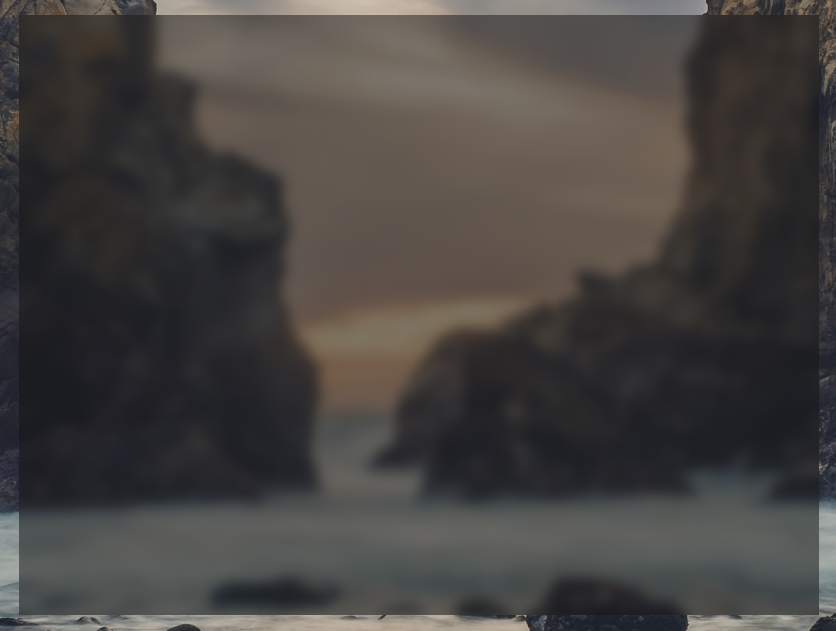
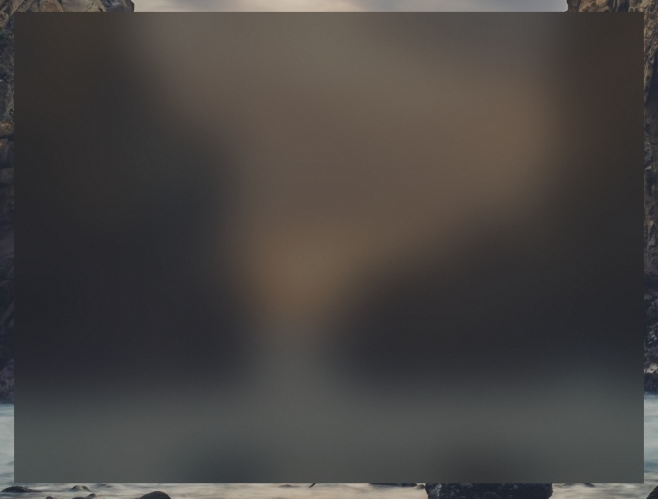
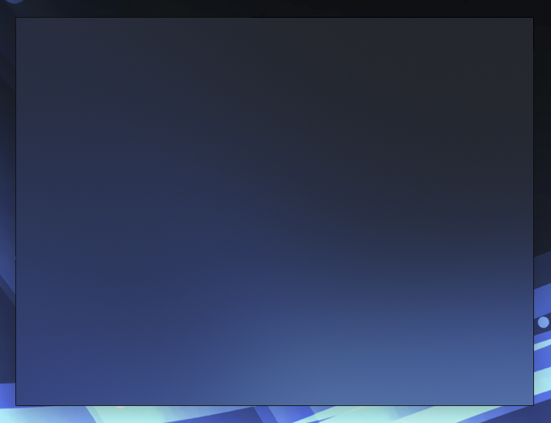

# window-vibrancy

[](https://crates.io/crates/window-vibrancy) [](https://docs.rs/window-vibrancy/) 
[](https://discord.gg/SpmNs4S)

Make your windows vibrant.

> [!Tip]
> If you're using `tauri@v1`, you need to use version `0.4` of this crate.

## Platform-specific

- **Linux**: Unsupported, Blur and any vibrancy effects are controlled by the compositor installed on the end-user system.

## Example

```rs
use window_vibrancy::{apply_blur, apply_vibrancy, NSVisualEffectMaterial};

#[cfg(target_os = "macos")]
apply_vibrancy(&window, NSVisualEffectMaterial::HudWindow, None, None)
    .expect("Unsupported platform! 'apply_vibrancy' is only supported on macOS");

#[cfg(target_os = "windows")]
apply_blur(&window, Some((18, 18, 18, 125)))
    .expect("Unsupported platform! 'apply_blur' is only supported on Windows");
```

### macOS Liquid Glass Effect (macOS 26+)

For macOS 26 and newer, you can use the new `apply_liquid_glass` function with the modern glass effect:

```rs
use window_vibrancy::{apply_liquid_glass, LiquidGlassOptions, NSGlassEffectViewStyle};

#[cfg(target_os = "macos")]
{
    let options = LiquidGlassOptions::new(NSGlassEffectViewStyle::Clear)
        .radius(26.0)
        .opaque(false);

    apply_liquid_glass(&window, options)
        .expect("Unsupported platform! 'apply_liquid_glass' is only supported on macOS 26+");
}
```

**Advanced Usage with WebView:**

If you manage the primary content view yourself (for example a `WKWebView`), you can pass its pointer via the `.content_view()` method so the crate can reparent it into the glass view's `contentView`:

```rs
use window_vibrancy::{apply_liquid_glass, LiquidGlassOptions, NSGlassEffectViewStyle};
use std::ptr::NonNull;

#[cfg(target_os = "macos")]
{
    let webview: NonNull<std::ffi::c_void> = find_webview(&window);

    let options = LiquidGlassOptions::new(NSGlassEffectViewStyle::Clear)
        .radius(26.0)
        .content_view(webview);

    apply_liquid_glass(&window, options)
        .expect("Failed to apply liquid glass");
}
```

For a complete example of WebView integration with Tauri, see [`examples/tauri/src-tauri/src/main.rs`](https://github.com/tauri-apps/window-vibrancy/blob/dev/examples/tauri/src-tauri/src/main.rs).

## Tauri

if you are using tauri, don't forget to:

* set `html, body { background: transparent }` see [index.html#L12](https://github.com/tauri-apps/window-vibrancy/blob/dev/examples/tauri/public/index.html#L12)
* set `"windows": [ { "transparent": true } ]` see [tauri.conf.json#L57](https://github.com/tauri-apps/window-vibrancy/blob/dev/examples/tauri/src-tauri/tauri.conf.json#L57)
* on **macos** set `"macOSPrivateApi": true` see [tauri.conf.json#L49](https://github.com/tauri-apps/window-vibrancy/blob/dev/examples/tauri/src-tauri/tauri.conf.json#L49)

For a more complete example of usage with [tauri](https://tauri.app/), see [`examples/tauri`](https://github.com/tauri-apps/window-vibrancy/tree/dev/examples/tauri).

## Available functions

| Function                                  |     Supported platforms      | Notes                                                                                              |
|:------------------------------------------|:----------------------------:|:---------------------------------------------------------------------------------------------------|
| `apply_blur`&`clear_blur`                 | Windows  7/10/11 (22H1 only) | Bad performance when resizing/dragging the window on Windows 11 build 22621+.                      |
| `apply_acrylic`&`clear_acrylic`           |        Windows 10/11         | Bad performance when resizing/dragging the window on Windows 10 v1903+ and Windows 11 build 22000. |
| `apply_mica`&`clear_mica`                 |          Windows 11          |                                                                                                    |
| `apply_vibrancy`&`clear_vibrancy`         |    macOS 10.10 and newer     |                                                                                                    |
| `apply_liquid_glass`&`clear_liquid_glass` |      macOS 26 and newer      | Modern glass effect with customizable radius, tint color, and opacity options.                     |

## Screenshots

<p align="center">

| apply_blur | apply_acrylic | apply_mica | apply_vibrancy |
| :---:      | :---:         | :---:      | :---:          |
|  |  |  |  |

</p>
